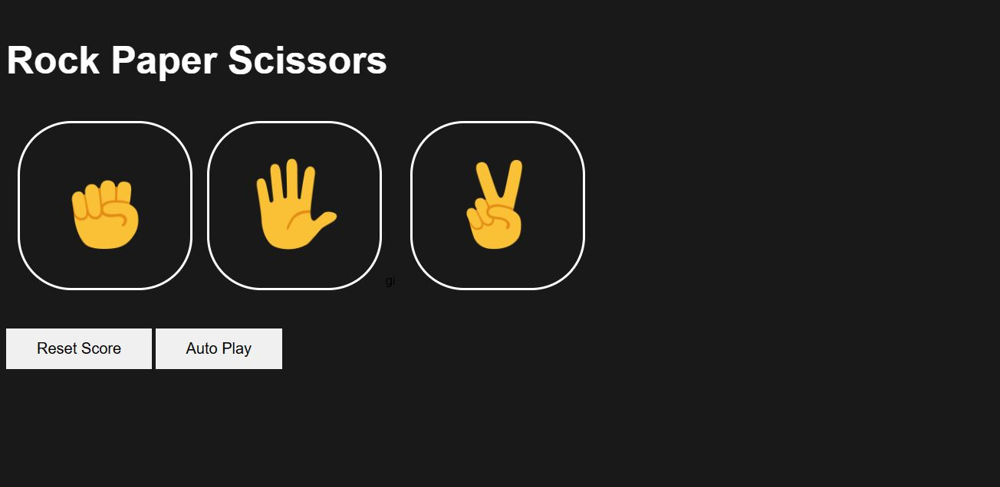

# Rock-Paper-Scissors-Game- Advanced Autometed Function
 Crated by JavaScript and HTML and responsive UI using CSS.

##features
-> Auto GamePlay Available.
-> Win, loss localStorage save.
->  Reset Score with warning!
-> Respnsive UI
-> Random Pick from Computer side
-> Full Resposive for (Mobile, Tablet, Laptop, Desktop).

## 🛠 Tech Stack

- HTML
- Vanila.js
- CSS

## Live Demo
Not Available

## ScreenShot


## Personal Note
Git commit history is not available for this project because it was developed on a low-end system.
Running Git or Git Extensions in VS Code significantly slowed down the editor, often causing it to hang.
As a result, version control was managed manually outside of VS Code for this project.


## 🚀 Run Locally

Clone the project:

```bash
git clone https://github.com/tousher101/rock-paper-scissors-Game.git
cd rock-paper-scissors-Game

#Then, simply open index.html in your browser.


